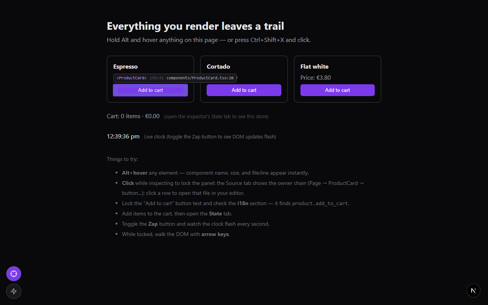
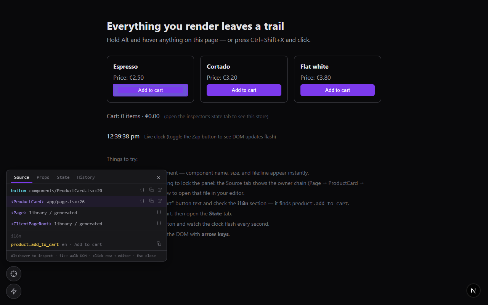
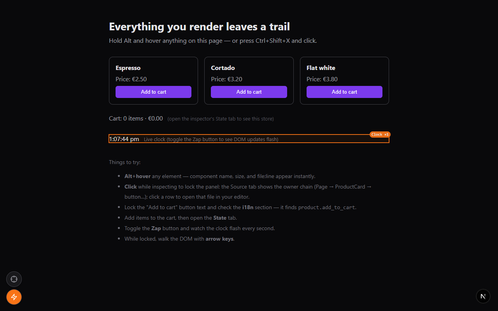

# next-dev-inspector

Dev-only floating inspector for **Next.js + React 18/19**. Hover or click any
DOM element to see **which source file (with line number) rendered it**, open
it straight in your editor, view live props and store state, reverse-lookup
i18n keys from rendered text, and flash DOM updates as they happen.

Zero runtime dependencies. Never ships to production when gated correctly
(see [Enabling it](#enabling-it-dead-code-elimination)).





## Try it — demo app

A runnable demo lives in [`demo/`](demo/):

```sh
cd demo
npm install
npm run dev
```

Open the printed URL and follow the "Things to try" list on the page: Alt+hover
anything, click to lock the source chain, open files in your editor, check the
i18n and State tabs, and toggle the Zap button while the on-page clock ticks.

## Features

- **Hover highlight** with a `<Component> · file.tsx:42` chip and element
  dimensions
- **Click to lock** a details panel with tabs:
  - **Source** — the full owner-component chain with `file:line` per entry;
    click a row to open it in your editor; copy paths and class lists
  - **Props** — live props of any component in the chain (compact JSON tree)
  - **State** — snapshot of your store (Redux, Zustand, anything — you supply
    the getter)
  - **History** — revisit the last 8 inspected elements
- **i18n reverse lookup** — see which translation key produced the rendered
  text (i18next-shaped resources)
- **Box-model overlay** — margin/padding bands like browser devtools
- **Alt+hover** quick inspect (no arming needed; modifier configurable)
- **Arrow keys** walk the DOM (parent/child/siblings) while locked
- **Re-render flasher** — with the optional [early hook](#true-re-render-flashes-optional-hook)
  installed, outlines components as they re-render, labeled with the component
  name and a per-element counter; without it, falls back to flashing raw DOM
  mutations
- **Copy for AI** — one click copies the component chain with file:line paths,
  props, classes, and i18n keys, ready to paste into Claude Code, Cursor, or
  any coding assistant
- **Draggable button cluster**, position persisted to `localStorage`
- Hotkey **Ctrl+Shift+X** to arm/disarm, **Esc** to close (configurable)

## Install

```sh
npm i -D next-dev-inspector
```

`react` and `react-dom` (>= 18, best on 19) are peer dependencies.

## Enabling it (dead-code elimination)

The inspector reads React's dev-only fiber internals (`_debugStack`,
`_debugOwner`), so it only works in development builds — and you should make
sure it's *compiled out* of production bundles. Gate it on constants your
bundler can statically evaluate:

### Pages Router (`_app.tsx`)

```tsx
import dynamic from "next/dynamic";

const DevInspector =
  process.env.NODE_ENV === "development" &&
  process.env.NEXT_PUBLIC_DEV_INSPECTOR === "true"
    ? dynamic(() => import("next-dev-inspector"), { ssr: false })
    : null;

export default function App({ Component, pageProps }) {
  return (
    <>
      <Component {...pageProps} />
      {DevInspector && <DevInspector />}
    </>
  );
}
```

### App Router (`app/layout.tsx`)

The package bundle carries `"use client"`, so it can be referenced from a
server layout via a small client wrapper:

```tsx
// app/dev-inspector.tsx
"use client";
import dynamic from "next/dynamic";

const Inspector = dynamic(() => import("next-dev-inspector"), { ssr: false });

export function DevInspectorMount() {
  if (
    process.env.NODE_ENV !== "development" ||
    process.env.NEXT_PUBLIC_DEV_INSPECTOR !== "true"
  ) {
    return null;
  }
  return <Inspector />;
}
```

Then render `<DevInspectorMount />` at the end of your root layout's body.

Run with the flag:

```sh
NEXT_PUBLIC_DEV_INSPECTOR=true next dev
```

Because both conditions are build-time constants, the `import()` — and the
whole package — is eliminated from production output.

## Configuration

All props are optional:

```tsx
<DevInspector
  enabled={true}                       // render nothing when false
  hotkey="ctrl+shift+x"                // arm/disarm combo
  hoverModifier="alt"                  // "alt" | "ctrl" | "meta" | "shift" | "none"
  storageKey="dev-inspector-pos"       // localStorage key for button position
  zIndex={2147483000}
  colors={{ accent: "#7c3aed", accentLight: "#a78bfa", flash: "#f97316" }}
  editorEndpoint="/__nextjs_launch-editor"          // GET file/line1/column1
  stackFramesEndpoint="/__nextjs_original-stack-frames" // POST fallback; null disables
  getI18nData={() => ({ data: i18n.store.data, language: i18n.language })}
  getStateSnapshot={() => store.getState()}
  stateLabel="Redux store"
/>
```

### Store snapshots (`getStateSnapshot`)

The State tab appears only when you pass a getter. Any store works — sync or
async:

```tsx
// Redux (dynamic import keeps the store out of the widget's graph)
getStateSnapshot={async () => (await import("@/lib/redux/store")).store.getState()}

// Zustand
getStateSnapshot={() => useBoundStore.getState()}

// Jotai (with a store instance)
getStateSnapshot={() => Object.fromEntries(myAtoms.map(a => [a.debugLabel, store.get(a)]))}
```

### True re-render flashes (optional hook)

By default the Zap button flashes *DOM mutations* — a memoized re-render that
changes no DOM stays invisible. For true re-render tracking, React must see a
DevTools hook **before it loads**, which a widget rendered by React cannot
provide. So the package ships one as an inline script you mount yourself:

```tsx
// App Router — top of app/layout.tsx's <body> (it's a server-safe component)
import { DevInspectorHook } from "next-dev-inspector/hook";

<body>
  <DevInspectorHook />   {/* renders nothing in production */}
  {children}
</body>
```

```tsx
// Pages Router — pages/_document.tsx, inside <Head>
import { devInspectorHookScript } from "next-dev-inspector/hook";

{process.env.NODE_ENV === "development" && (
  <script dangerouslySetInnerHTML={{ __html: devInspectorHookScript }} />
)}
```

With the hook installed, flashes carry component names (`Clock ×3`) and fire
per re-render — the widget detects it automatically. If the real React
DevTools extension is present, the script piggybacks on its hook instead of
replacing it.



### Copy for AI

The locked panel's footer has a **Copy for AI** button that puts a compact,
paste-ready context block on the clipboard:

```
Inspected element (via next-dev-inspector):

Component chain (innermost first):
1. button — components/ProductCard.tsx:20
2. <ProductCard> — app/page.tsx:26
3. <Page> — (library / generated)

Props of <ProductCard>:
{ name: "Espresso", price: 2.5 }

i18n matches:
- product.add_to_cart (en) = "Add to cart"
```

Paste it into your AI assistant and it knows exactly which file and component
you're talking about. (`buildAiContext`/`serializeValue` are also exported if
you want the same block programmatically.)

### i18n reverse lookup (`getI18nData`)

Pass i18next-shaped resources (`{ [lng]: { [namespace]: nestedTree } }`) and
the current language. When you lock an element, the Source tab lists
translation keys whose value matches its rendered text — exact matches first,
then `{{interpolated}}` values matched by static prefix.

## How it works (and its limits)

- **React 19 removed `_debugSource`.** Source locations are recovered from the
  dev-only fiber `_debugStack` — an `Error` captured at each JSX callsite —
  walking the `_debugOwner` chain. This exists only in development React.
- **Turbopack (`next dev`):** the widget fetches the chunk's sibling
  `<chunk>.js.map` and decodes it client-side (index maps with `sections[]`,
  `file:///` sources). The dev server's `POST /__nextjs_original-stack-frames`
  resolver is *not* used for browser chunk frames — it hangs on `http://` file
  URLs and returns identity mappings.
- **webpack (`next dev`):** `webpack-internal:///` frames fall back to the
  server resolver endpoint.
- **Open in editor** uses `GET /__nextjs_launch-editor?file=&line1=&column1=`,
  which accepts `file://` URLs, absolute paths, and project-relative paths.
  Other dev servers (e.g. Vite's `/__open-in-editor`) can be targeted via
  `editorEndpoint` — but note Vite serves different map URLs, which is
  untested territory.
- **Flasher:** without the optional hook it observes *DOM mutations* (React
  commits), so a memoized re-render that changes no DOM won't flash. The
  `next-dev-inspector/hook` inline script installs a minimal
  `__REACT_DEVTOOLS_GLOBAL_HOOK__` before React loads and walks each commit
  as a diff against the alternate fiber tree (pruning reused subtrees, the
  way React DevTools does) — that upgrade makes flashes track real
  re-renders with component names.
- **Library components** resolve to the caller's JSX callsite (the first
  app-owned frame) — that's usually what you want anyway.

## Development

```sh
npm install
npm run test        # vitest (pure-logic suites: stack parsing, VLQ maps, i18n)
npm run typecheck
npm run build       # tsup → dist/ (ESM + CJS + d.ts)
```

## License

MIT
